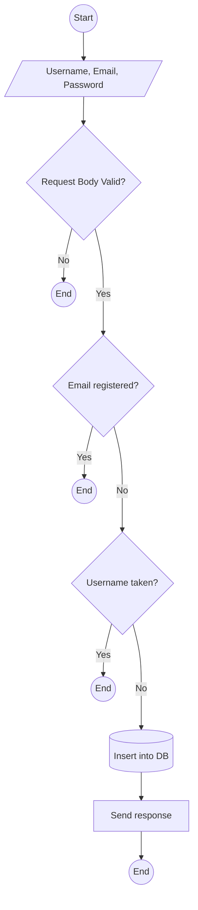
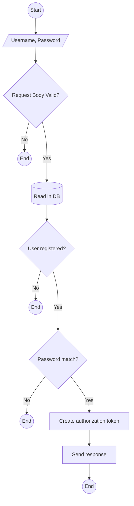
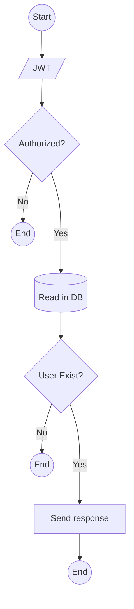
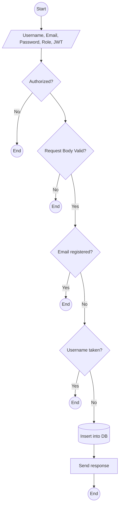
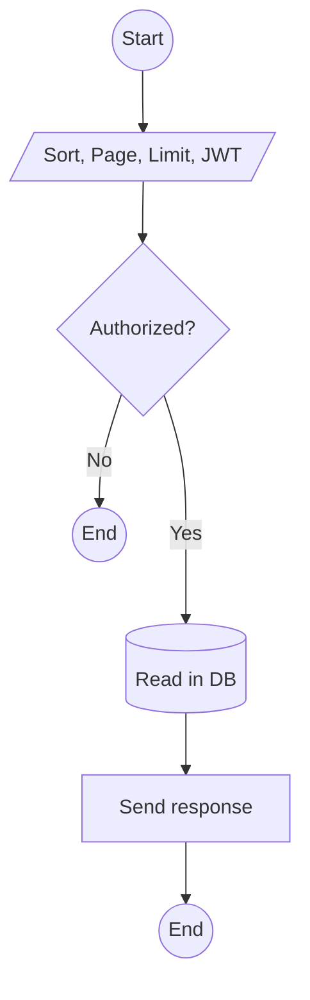
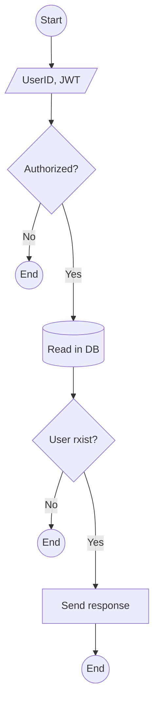
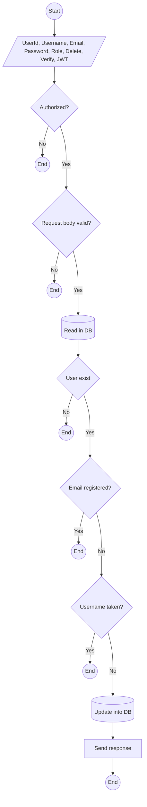
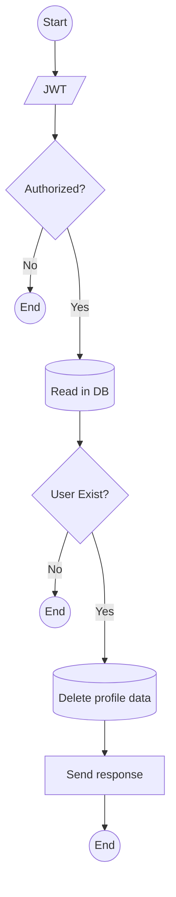

# Deall! Test
Demo of NodeJS Express to do CRUD operation on User Collection

## How To Start

### Dependencies

- NodeJS v14 (or higher)
- MongoDB v4.4

### Running the Server

1. Clone this repository
  
2. Install modules needed

```
npm install
```

3. Create `.env` from the example `.env.example`

4. Make sure the database instance  is running

5. Run the server

```
npm start
```

6. Migrate admin credential by accessing `/migrate` endpoints in your browser or postman with `GET` method.

### Development 

After running `npm install`, install husky to force pre-commit hook by running this command

```
npm prepare
```

### Admin Credential

This is the default user credentials

```
{
  "username": "usedeall",
  "password": "usedeall!"
}
```

If you want to update it, [click here](./migrations/admin.json) to open `admin.json` inside `migrations` dir. 

## Project Structure

- **bin**: server runner.
- **deploy**: deployment files (docker, k8s).
- **docs**: server documentations (API docs & others).
- **libs**: libraries used in the sources.
- **migrations**: admin account migration file.
- **middlewares**: middlewares for routes.
- **modules**: sources for api handling.
- **routes**: api routes.
- **test**: unit tests & integration tests.

## Conventions
### Code Style

Code style follows eslint with airbnb style [(click here for the detail)](https://github.com/airbnb/javascript).

### Commit Pre-Hook

Tests & linter will run on git commit pre-hook using husky.

Add `-n` or `--no-verify` flag to git push command to skip it but it is not recommended.

### Commit Message

Commit message style will be forced with commitlint.

Commit message must be prefixed by build, chore, ci, docs, feat, fix, perf, refactor, revert, style, test.

This is the example of how commit message should be:

```
git commit -m "feat: add get user profile api"
```

## API Routes

- `GET` `/`: Ping the server.
- `GET` `/docs`: OpenAPI (Swagger 3.0) documentation.
- `GET` `/migrate`: Run migration to create admin.
- `POST` `/api/v1/auth/register`: Register.
- `POST` `/api/v1/auth/login`: Login.
- `POST` `/api/v1/auth/refresh`: Refresh Token.
- `GET` `/api/v1/profile`: Get Profile (authenticated user & admin only).
- `POST` `/api/v1/users`: Create a new user (admin only)
- `GET` `/api/v1/users`: Read all existing users (admin only)
- `GET` `/api/v1/users/:id`: Read an existing user (admin only)
- `PUT` `/api/v1/users/:id`: Update an existing user (admin only)
- `DELETE` `/api/v1/users/:id`: Delete an existing user (admin only)

## API Documentation

Run the server and go to `/docs` for OpenAPI Documentation, it points to `http://localhost:8000` by default.

You can also [click here](./docs/postman.json) to open `postman.json` for Postman collection.

## How It Works
### Register


### Login



### Get Profile


### Create User


### Read Users (collection)


### Read User (single)


### Update User


### Delete User

## Deployment

### Dependencies
- Docker
- Docker Compose (docker compose)
- Kubernetes (kubectl)

### Configurations

Kubernetes (k8s) configs are stored in [deploy](./deploy/) directory.

To build docker image, use `npm run build` command.

To the image with compose, use `npm run compose` command.

To apply k8s configs, use `npm run kube` command.